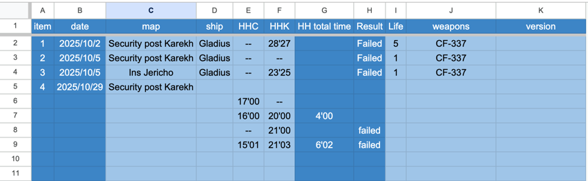

Implement App-Script of Google sheet for personal practice on the Area Command-Pirate Swarm of Star Citize flying log.

[DEMO Sheet](https://docs.google.com/spreadsheets/d/1-OhV43fzGFjN5EoMSNNFcIudTckc0a7HdU1LWKI-9wc/edit?usp=sharing)

# AC_PS_flying_log
Google Apps Script - Auto-fill and Time Calculator for "AC" Sheet

## Overview
This script automatically manages data entry and performs time calculations on the "AC" sheet when specific columns are edited.

## Features
### 1. Auto-numbering and Date Stamping (Column C trigger)
   When you edit Column C:

Column A: Auto-fills with an incremental number (previous row's value + 1) if empty
Column B: Auto-fills with the current date in yyyy/MM/dd format
Clear behavior: If Column C is cleared, both Column A and B are also cleared

### 2. Time Difference Calculator (Column E or F trigger)
   When you edit Column E or Column F:

Column G: Calculates the time difference (F - E) in mm'ss format

Only calculates if both E and F are not empty and not equal to "--"
Uses absolute value for the result
If conditions aren't met, Column G is cleared

### 3. Performance Check (Column F trigger)
   When you edit Column E or Column F:

Column H: Displays performance status based on Column F value

If F ≤ 20'00 (20 minutes): Column H remains empty (pass)
If F > 20'00: Column H displays "failed"
If F is empty or "--": Column H is cleared

## Input Format

Time values in Column E and F should be in mm'ss format (e.g., 1'30, 15'45, 20'00)
The script handles both straight apostrophes (') and curly apostrophes (')

## Sheet Name

This script only works on the sheet named "AC"
